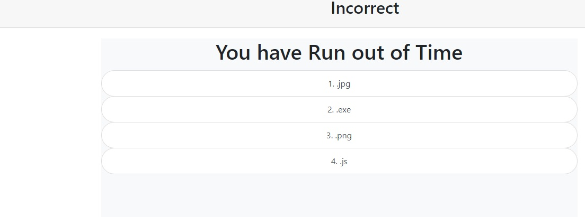

# Challenge 4 - Timed Javascript Quiz

##
This week I've created timed quiz.

This particular project allows the user to take a time restricted quiz, the topic of which is Javascript. Features of this quiz include a timer that docks 5 seconds for every incorrect answer. The questions and answers and populated from a 2D array, allowing for easy scaling of both depth and breadth of the question-set.

Unfortunately I've not been able get localStorage to work with my storage arrays.

### Screenshots 
 
The question/answer array 
 
 
Start button disappears when unneccesary  
 
 
 
Like the Hall and Oates song 
 
 
The quiz lets you know how you answered the previous question 
  

#### Resouces used 
Offical Bootstrap documentation